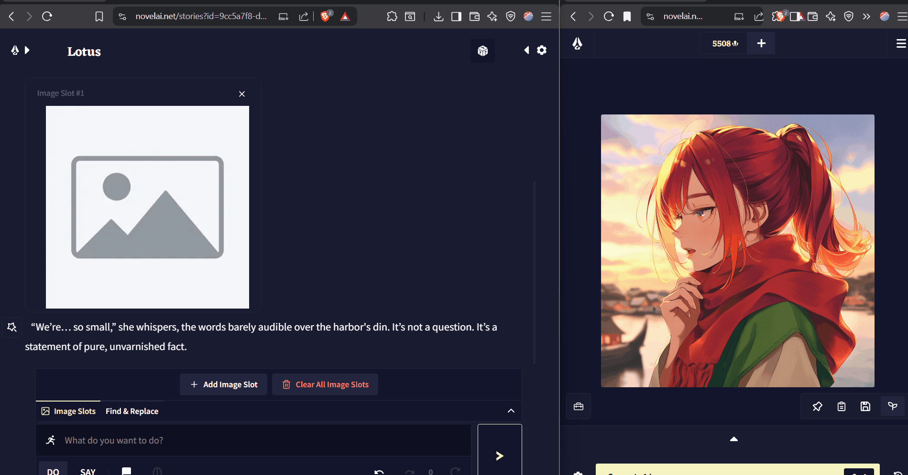

    
    <h1>Pixu for NovelAI</h1>

    Not affiliated with Anlatan or NovelAI.

## What is this?

Pixu is a small browser extension for NovelAI that makes moving images into your stories easier.

Images are stored locally in your browser, so nothing is uploaded anywhere else.

## How it works

You can grab an image from NovelAI image generator and drop it straight into your story, and Pixu handles the insert/attach step for you.

## Install

- Grab the latest release zip
- Load it as an unpacked extension in your browser
- Download and import the script into your User Scripts https://github.com/lucasshuan/NovelAI_Pixu_Naiscript/releases
- Open the NovelAI story page https://novelai.net/stories

## Planned Features

- User

## Known Issues

- Widgets make the screen go flickering when you are all the way scrolled down.

## Notes

This is a fan-made project. If something breaks, open an issue with steps to reproduce
